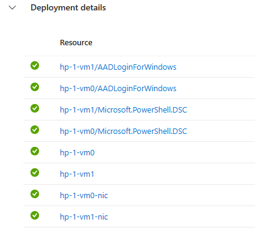
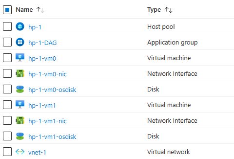

# bfrank's AVD Native (on Azure) Infrastructure As Code Samples

This repo contains my artefacts for automating the deployment of AVD resources.

## Contents  
|  |  |
|--|--|
|[00-deployBicep.ps1](./00-deployBicep.ps1) | kicks off the bicep deployment of 2 EntraID only joined session hosts with HP, App group and, Workspace into an existing VNET. |
|[00-avdcomplete.bicep](./00-avdcomplete.bicep) | corresponding .bicep file to above scenario.   |
|| Session hosts created in deployment|
|| Resources used (vnet-1) or created (others) in this bicep deployment |